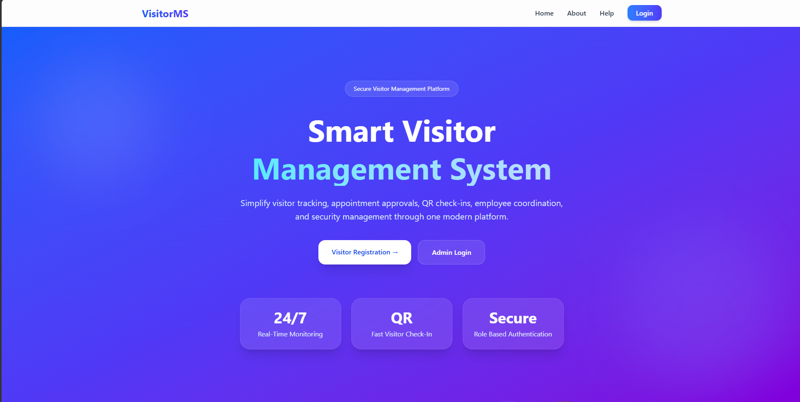
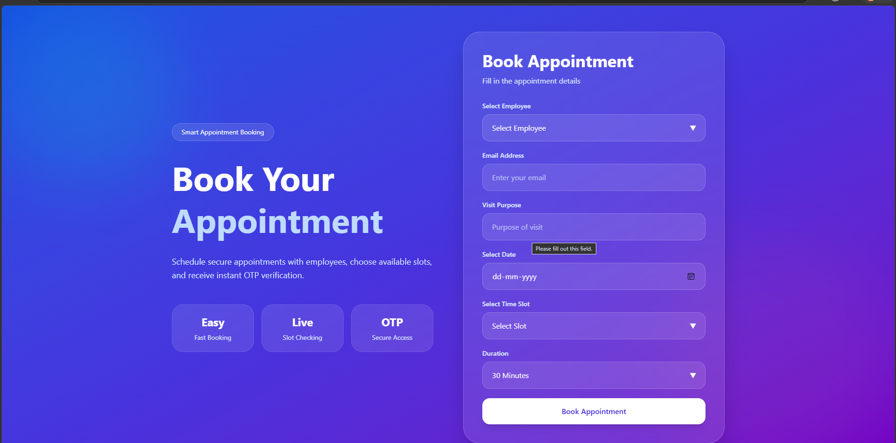
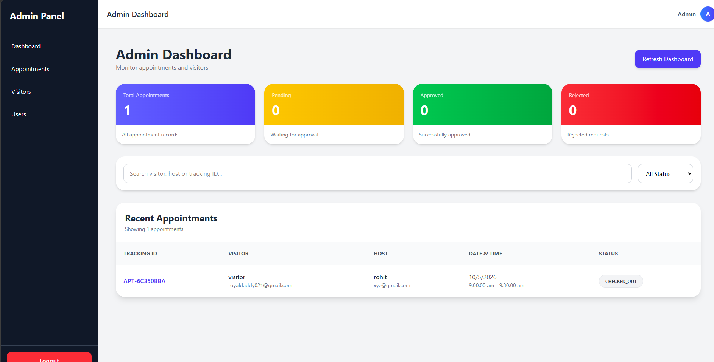
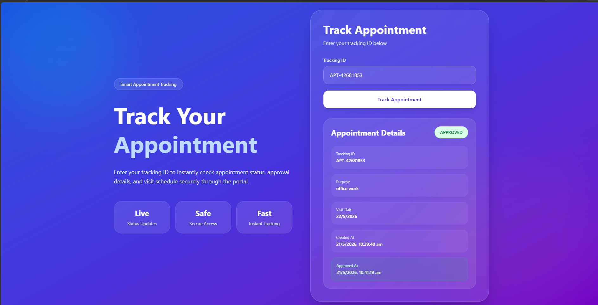
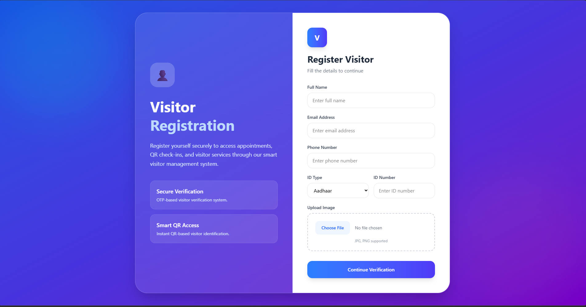
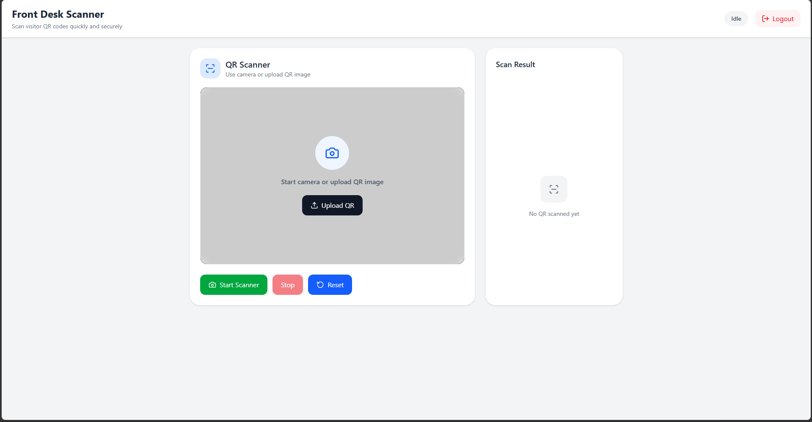

<<<<<<< HEAD
## Acknowledgement of AI Assistance

I would like to acknowledge the use of Artificial Intelligence (AI) tools, specifically ChatGPT, as a guidance and learning resource during the development of this project.

AI assistance was mainly used to better understand development practices, improve code structure, debug issues, and learn the integration of third-party libraries and services. For example, during deployment I faced difficulties managing API endpoints manually across multiple API calls. To improve this, I sought guidance and learned the practice of creating a centralized endpoints file and importing endpoints wherever required.

Similarly, while improving backend controllers, I learned better error-handling practices such as using a common async error-handling function instead of repeatedly writing try-catch blocks inside every API controller. AI guidance also helped me understand concepts related to project structure, service integration, and implementation details whenever I got stuck during development.

AI assistance was also used while structuring and organizing the project documentation, including the README file structure and setup instructions.

At the same time, I also referred to official documentation of libraries and services to understand their proper usage and implementation. The overall MVC project structure used in this project was based on concepts taught by my instructor, and several frontend practices such as error-handling pages were inspired by learnings from previous assignments.

Initially, I was also not fully aware that AI tools could be used as a guidance and learning resource during development. Over time, I used them responsibly to improve my understanding of concepts and development practices rather than simply generating solutions without learning them.

AI tools were used only as a support system for learning, guidance, and improving development practices. The final implementation, integration, debugging, and understanding of the project were completed by me.


## Learning Outcomes

Through the development of this project, I gained practical experience in full-stack web development using the MERN stack. I learned how to structure scalable backend applications using the MVC architecture, manage APIs efficiently, handle authentication and authorization, integrate third-party libraries and services, and work with MongoDB relationships using Mongoose.

I also improved my understanding of error handling, reusable code practices, PDF generation, QR-based workflows, environment variable management, deployment practices, and project documentation. Working on this project helped me strengthen both problem-solving skills and real-world development practices.

Additionally, I explored the use of AI tools as a learning and guidance resource to better understand development concepts, debugging approaches, and industry practices while continuing to refer to official documentation and course learnings throughout the project.


# demo video link :-https://drive.google.com/file/d/14jSV8N3zBZEAGvT9ix33Tr-yS02itQ32/view?usp=drive_link

# Screenshots

## Home Page


## Appointment Booking


## Admin Dashboard


## Tracking Dashboard


## Visitor Registration 


## Front desk dashboard

=======


# Frontend Overview

The frontend of the Visitor Management System is built using React.js and Tailwind CSS.

It provides a modern responsive interface for:

* Visitor registration
* OTP verification
* Appointment booking
* Appointment tracking
* Admin dashboard
* Employee dashboard
* Front desk QR scanning
* Role-based navigation

The frontend communicates with the backend REST APIs using Axios.

---

# Frontend Features

## Public Pages

* Home Page
* About Page
* Help Page
* Visitor Registration
* OTP Verification
* Appointment Booking
* Appointment Tracking

---

## Admin Dashboard

Admin can:

* Manage visitors
* Manage appointments
* View analytics
* Manage employees/users
* Approve or reject appointments

---

## Employee Dashboard

Employees can:

* View assigned appointments
* Approve appointments
* Reject appointments
* Track visitor schedules

---

## Front Desk Dashboard

Frontdesk staff can:

* Scan QR codes
* Check visitors in
* Check visitors out
* Verify appointment validity

---

# Frontend Tech Stack

| Technology       | Purpose                |
| ---------------- | ---------------------- |
| React.js         | Frontend Library       |
| React Router DOM | Routing                |
| Tailwind CSS     | UI Styling             |
| Axios            | API Requests           |
| Framer Motion    | Animations             |
| HTML5 QRCode     | QR Scanner             |
| Recharts         | Dashboard Analytics    |

---

# Frontend Setup

## Move to Frontend Folder

```bash
cd frontend
Install Dependencies
npm install
Create Environment Variables

Create .env file inside frontend folder.

Example:

VITE_API_URL=http://localhost:5000
Start Frontend Server
npm run dev
Frontend Runs On
http://localhost:5173
Frontend Folder Structure
frontend/
│
├── public/
├── src/
│
├── components/
├── pages/
├── routes/
├── service.js/
├── assets/
│
├── App.jsx
├── main.jsx
├── package.json
└── vite.config.js
Frontend Pages
Page	Description
Home	Landing page
About	Project overview
Help	User guidelines
Register	Visitor registration
OTP	OTP verification
Booking	Appointment booking
Tracking	Track appointments
Admin Dashboard	Admin management
Employee Dashboard	Employee operations
Frontdesk Dashboard	QR scanning system
# Visitor Management System - Backend

Backend REST API for the Visitor Management System built using Node.js, Express.js, and MongoDB.

This backend handles:

* Visitor registration
* OTP verification
* Appointment management
* QR-based check-in/check-out
* Role-based authentication
* Email notifications
* Slot management
* Admin operations

---

# Features

## Authentication System

* Email OTP verification
* JWT-based authentication
* Role-based authorization
* Secure protected routes

---

## Visitor Management

* Register visitor
* Upload visitor image
* Verify visitor
* Delete visitor
* Fetch all visitors

---

## Appointment System

* Create appointment
* Appointment approval/rejection
* Real-time slot availability checking
* Track appointments using tracking ID
* QR code generation
* Check-In / Check-Out system

---

## Admin Features

* Dashboard analytics
* Visitor management
* Appointment management
* User management
* Role handling

---

# Tech Stack

| Technology | Purpose             |
| ---------- | ------------------- |
| Node.js    | Runtime Environment |
| Express.js | Backend Framework   |
| MongoDB    | Database            |
| Mongoose   | ODM                 |
| JWT        | Authentication      |
| Nodemailer | Email Sending       |
| Multer     | File Upload         |
| QRCode     | QR Generation       |
| bcrypt     | Password Hashing    |

---

# Project Setup

## 1. Clone Repository

```bash
git clone https://github.com/your-username/your-repository-name.git
```

---

## 2. Move to Backend Folder

```bash
cd backend
```

---

## 3. Install Dependencies

```bash
npm install
```

---

# Environment Variables

Create a `.env` file inside backend folder.

Example:

```env
PORT=5000

MONGO_URI=your_mongodb_connection_string

JWT_SECRET=your_secret_key

EMAIL_USER=your_email@gmail.com
EMAIL_PASS=your_email_password


```

---

# Run Development Server

```bash
npm run dev
```


---

# Run Production Server

```bash
npm start
```

---

# Backend Runs On

```bash
http://localhost:5000
```

---

# API Base URL

```bash
http://localhost:5000/
```

---
# Create dummy data
---
```bash
npm run seed
```
---

# API Structure

## Authentication APIs

| Method | Endpoint           | Description |
| ------ | ------------------ | ----------- |
| POST   | `/auth/otp`        | Send OTP    |
| POST   | `/auth/otp/verify` | Verify OTP  |
| POST   | `/auth/login`      | Admin Login |

---

## Visitor APIs

| Method | Endpoint               | Description      |
| ------ | ---------------------- | ---------------- |
| POST   | `/visitors`            | Register Visitor |
| GET    | `/visitors`            | Get All Visitors |
| PATCH  | `/visitors/:id/verify` | Verify Visitor   |
| DELETE | `/visitors/:id`        | Delete Visitor   |

---

## Appointment APIs

| Method | Endpoint                        | Description             |
| ------ | ------------------------------- | ----------------------- |
| POST   | `/appointments`                 | Create Appointment      |
| GET    | `/appointments/:trackingId`     | Track Appointment       |
| GET    | `/appointments`                 | Get Appointments        |
| PATCH  | `/appointments/:id/approve`     | Approve Appointment     |
| PATCH  | `/appointments/:id/reject`      | Reject Appointment      |
| POST   | `/appointments/check-slot`      | Check Slot Availability |
| GET    | `/appointments/slots/:hostId`   | Get Slot Details        |
| POST   | `/appointments/CheckInCheckOut` | QR Check-In / Check-Out |

---

# Request Flow

## Visitor Registration Flow

1. Visitor enters details
2. OTP sent to email
3. OTP verification completed
4. Visitor account created
5. Appointment booking allowed

---

## Appointment Booking Flow

1. Visitor selects employee
2. Selects date and slot
3. Backend checks slot availability
4. Appointment created
5. Email confirmation sent

---

## Appointment Approval Flow

1. Admin/Employee reviews request
2. Appointment approved/rejected
3. QR code generated
4. Approval email sent to visitor

---

## QR Check-In Flow

1. Visitor shows QR code
2. Front desk scans QR
3. System validates appointment
4. Visitor checked in/out

---

# Folder Structure

```bash
backend/
│
├── controllers/
│   ├── authController.js
│   ├── visitorController.js
│   └── appointmentController.js
│
├── services/
│   ├── visitorService.js
│   ├── appointmentService.js
│   └── authService.js
│
├── routes/
│   ├── authRoutes.js
│   ├── visitorRoutes.js
│   └── appointmentRoutes.js
│
├── middleware/
│   ├── authMiddleware.js
│   ├── roleMiddleware.js
│   └── uploadMiddleware.js
│
├── models/
│   ├── userModel.js
│   ├── visitorModel.js
│   └── appointmentModel.js
│
├── utils/
│   ├── asyncHandler.js
│   ├── sendEmail.js
│   └── templates/
│
├── uploads/
├── config/
├── .env
├── server.js
└── package.json
```

---

# Authentication & Authorization

## JWT Authentication

Protected APIs require JWT token.

Example:

```http
Authorization: Bearer your_token
```

---

## Role-Based Access

| Role      | Access               |
| --------- | -------------------- |
| ADMIN     | Full System Access   |
| EMPLOYEE  | Appointment Handling |
| FRONTDESK | QR Scanning          |
| VISITOR   | Appointment Booking  |

---

# Email Notifications

The system sends automated emails for:

* OTP verification
* Appointment request
* Appointment approval
* Appointment rejection

---

# QR Code System

QR codes are automatically generated after appointment approval.

Used for:

* Secure check-in
* Secure check-out
* Visitor validation

---

# Security Features

* JWT Authentication
* Protected Routes
* OTP Verification
* QR Verification
* Role-Based Access
* Input Validation
* Secure File Uploads

---

# Scripts

## Development

```bash
npm run dev
```

## Production

```bash
npm start
```

---

# Important Notes

* Never upload `.env`
* Add `node_modules` to `.gitignore`
* Store JWT secret securely
* Keep email credentials private

---

# Future Improvements

* Sms Notifications
* Live Dashboard Analytics
* Face Recognition Check-In


---


